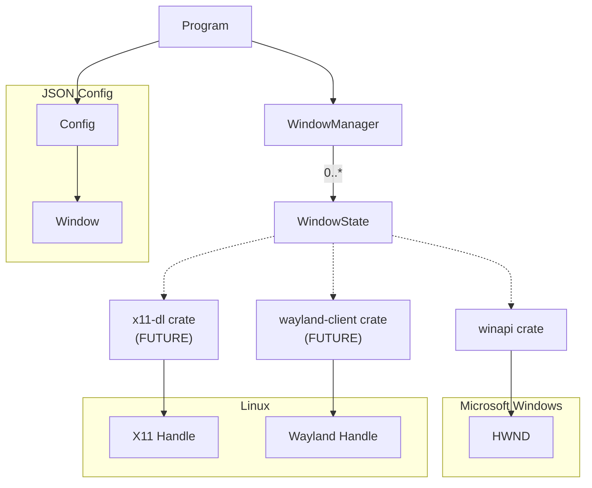
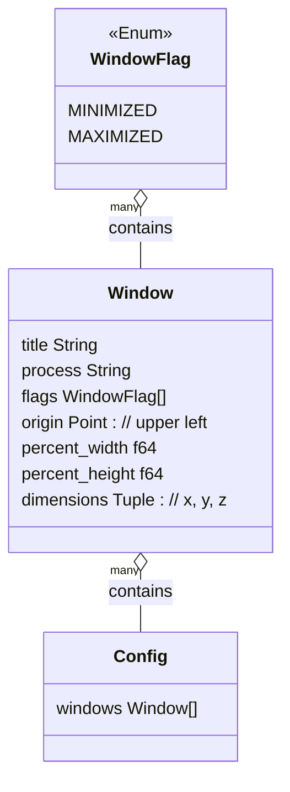

The High Level Design (HLD) intends to present a 10,000 ft view of the components in this program.

## JSON Config

The `Config` class is intended to encapsulate a layout profile loaded by the program.
A user may have multiple configurations to layout `Window`s in different positions based on what they are doing.

### Window class

The `Window` class encapsulates the information to control how a program window will be laid out.
The `title` and `process` are the only attributes used to select a window from the list of windows available to be controlled.

* `title`: the title of window to control
* `process`: the process of window to control
* `flags`: _(optional)_ list of flags to control the window
* `origin`: _(optional)_ the upper left of the window
* `percent_width`: _(optional)_ percentage of the width of the screen to expand/contract to
* `percent_height`: _(optional)_ percentage of the height of the screen to expand/contract to
* `dimensions`: _(optional)_ hard-coded pixel sizes of the window
    * `x`: width of the window
    * `y`: height of the window
    * `z`: _(optional)_ controls the order of the window in scenarios where other windows overlap
