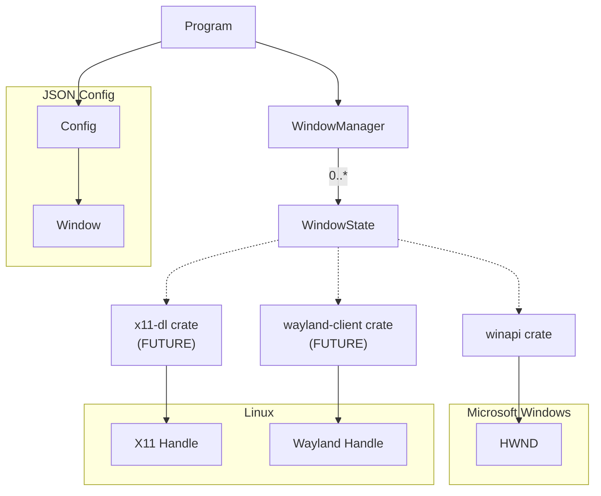

The High Level Design (HLD) intends to present a 10,000 ft view of the components in this program.

```mermaid
flowchart

program[Program] --> windowManager[WindowManager]
windowManager[WindowManager] -- 0..* --> windowState[WindowState]
program[Program] --> config[Config]

subgraph JSON Config
    config[Config] --> window[Window]
end

subgraph Microsoft Windows
    hwnd[HWND]
end

subgraph Linux
    x11[X11 Handle]
    wayland[Wayland Handle]
end

windowState[WindowState] -.-> winapi[winapi crate]
winapi[winapi crate] --> hwnd[HWND]

windowState[WindowState] -.-> x11-dl["x11-dl crate <br>(FUTURE)"]
x11-dl["x11-dl crate <br>(FUTURE)"] --> x11[X11 Handle]

windowState[WindowState] -.-> wayland-client["wayland-client crate <br>(FUTURE)"]
wayland-client["wayland-client crate <br>(FUTURE)"] --> wayland[Wayland Handle]
```
